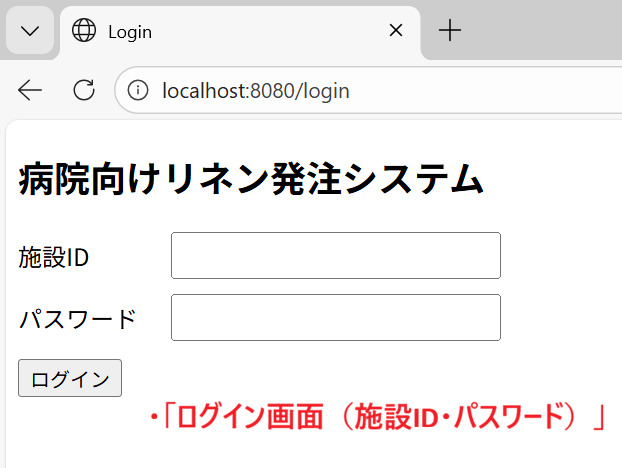
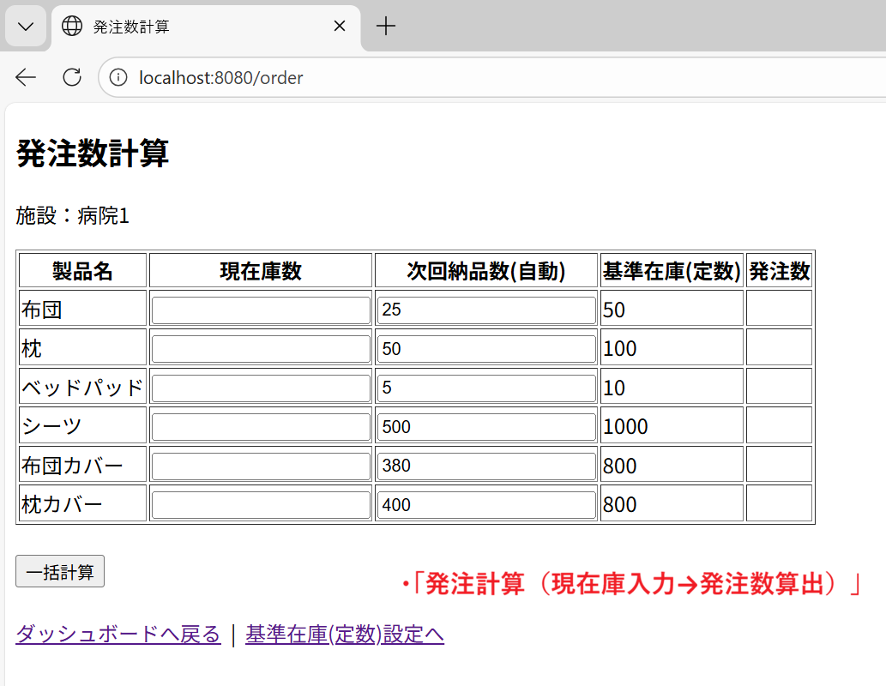
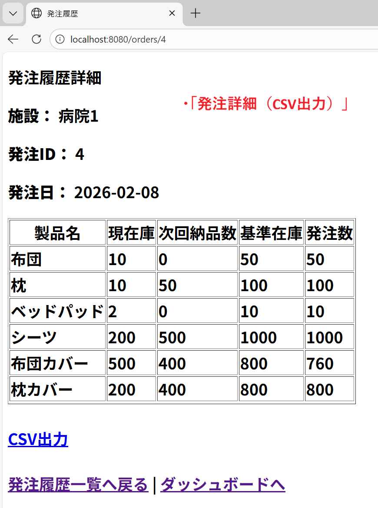

# 病院向けリネン発注数計算アプリ（Spring Boot + MySQL）

病院内で行っているリネン発注数の計算をWebアプリ上で自動化するためのアプリです。  
従来は担当者が在庫数を確認し、手計算した結果を所定の用紙へ記入していましたが、本アプリにより計算ミスの削減・作業時間の短縮を狙います。

---

## 解決したい課題
- 紙運用＋手計算のため、転記ミス・計算ミスが起きやすい
- 施設ごとに取扱商品や基準在庫（定数）が異なり、管理が手間
- 次回納品数を前回発注実績から自動入力したい（初回は0）

---

## 主な機能
- ログイン（施設ID・パスワード）
- ダッシュボード
- 基準在庫（定数）設定（施設×アイテム単位で変更）
- 発注計算（現在庫入力 → 発注数自動計算）
- 次回納品数は前回発注履歴から自動入力（初回は0）
- 例外的に納品数が変動する場合に備え、画面上で編集可能
- 発注確定（DB保存）
- 発注履歴一覧／発注詳細
- 発注データCSV出力

---

## 画面遷移（使い方）
1. `/login` でログイン（施設ID・パスワード）
2. `/dashboard` から各機能へ遷移
3. 必要に応じて `/facility/settings` で基準在庫（定数）を設定
4. `/order` で現在庫数を入力し「一括計算」
5. 計算結果確認後「確定」で発注データを保存
6. `/orders/history` で履歴を確認（詳細・CSV出力も可能）

---

## URL一覧（ルーティング）
- `GET  /login`：ログイン画面
- `POST /login`：ログイン処理
- `GET  /dashboard`：ダッシュボード
- `GET  /facility/settings`：基準在庫（定数）設定画面
- `POST /facility/settings`：基準在庫更新
- `GET  /order`：発注計算画面
- `POST /order/calculate`：発注数計算
- `POST /order/confirm`：発注確定（DB保存）
- `GET  /orders/history`：発注履歴一覧
- `GET  /orders/{orderId}`：発注詳細
- `GET  /orders/{orderId}/csv`：CSV出力

---

## 計算ロジック（概要）
入力：
- 現在庫数
- 次回納品数（初期値は前回発注数の半分、必要に応じて編集可）
- 基準在庫（定数）

出力：
- 発注数（上限あり）

※実装上は `orderQuantities = min(Y * 2, 定数)` のように上限を持たせています。  
（発注数が定数を超える場合は定数で頭打ち）

---

## 効果（試算）
本アプリ導入による効果を以下の前提で概算しました。

- アプリ導入後の作業時間：**約15秒 / 回**（在庫数入力→自動計算）
- 実施頻度：**4回 / 月**
- 想定時給：**1,100円**
- 現状作業は、電卓での計算・紙への転記が中心で、作業者の習熟度により所要時間に差があるため、複数パターンで試算しています。

### 試算結果（1施設あたり）
- **パターンA（計算に慣れている場合：3分→15秒）**
  - 年間削減時間：`(3 − 0.25) × 4 × 12 = 132分 ≒ 2.2時間`
  - 年間削減額：`2.2時間 × 1,100円 ≒ 2,420円`

- **パターンB（一般的な運用：5分→15秒）**
  - 年間削減時間：`(5 − 0.25) × 4 × 12 = 228分 ≒ 3.8時間`
  - 年間削減額：`3.8時間 × 1,100円 ≒ 4,180円`

- **パターンC（電卓利用・転記が多い場合：10分→15秒）**
  - 年間削減時間：`(10 − 0.25) × 4 × 12 = 468分 ≒ 7.8時間`
  - 年間削減額：`7.8時間 × 1,100円 ≒ 8,580円`

### 横展開した場合の効果（概算）
まずは自分の担当エリア（6施設）での横展開を想定すると、同様の運用をしている **5施設**に導入できる見込みです（上記の「1施設あたり」試算×施設数で概算）。

- パターンA（3分→15秒）：`約2,420円 × 5施設 ≒ 12,100円/年`
- パターンB（5分→15秒）：`約4,180円 × 5施設 ≒ 20,900円/年`
- パターンC（10分→15秒）：`約8,580円 × 5施設 ≒ 42,900円/年`

※横展開可否は施設ごとの運用条件（取扱品目・業務フロー）によりますが、同様の運用をしている施設では展開できる可能性があります。  
※上記は試算です。実際の削減効果は運用条件により変動します。

---

## DBテーブル
- `facility`（施設）
- `users`（ユーザー）
- `linen_item`（アイテム）
- `facility_linen`（施設×アイテムの基準在庫）
- `order_header`（発注ヘッダ）
- `order_detail`（発注明細）

---

## 使用技術
- Java 17
- Spring Boot
- Spring Data JPA / Hibernate
- Thymeleaf
- MySQL

---

## 起動方法（ローカル）

### 前提
- Java 17
- MySQL 8.x
- Maven（`mvnw` 同梱のため未インストールでも可）
- Windows想定（Mac/Linuxでも同様に実行可）

---

### 1) MySQLを起動しDB作成
MySQLにログイン（例：root）してDBを作成します。

```sql
CREATE DATABASE linen_order_app
  DEFAULT CHARACTER SET utf8mb4
  COLLATE utf8mb4_general_ci;
```

---

### 2) アプリ用ユーザー作成（任意）
既に `linen` ユーザーがある場合は不要です。  
この手順で設定したパスワードは、後の `DB_PASS`（環境変数）に使用します。

```sql
-- 例：アプリ用ユーザー作成（パスワードは任意）
CREATE USER 'linen'@'localhost' IDENTIFIED BY 'your_password';

-- DBに対する権限付与
GRANT ALL PRIVILEGES ON linen_order_app.* TO 'linen'@'localhost';

-- 反映
FLUSH PRIVILEGES;
```

---

### 3) 初期データ投入（db/data.sql）
プロジェクト直下（pom.xml がある階層）で、以下を実行します。
日本語データを入れるため、文字化け対策として --default-character-set=utf8mb4を付けています。
Windows（cmd）例：

```bat
cd C:\workspace\linen-order-app\linen-order-app
mysql --default-character-set=utf8mb4 -u linen -p linen_order_app < db\data.sql
```

投入後、MySQLで確認：

```sql
USE linen_order_app;

SELECT * FROM facility;
SELECT * FROM linen_item;
SELECT * FROM users;
SELECT * FROM facility_linen;
```

---

### 4) 環境変数 DB_PASS を設定（重要）
application.yaml では password: ${DB_PASS:} を参照しているため、起動前に DB_PASS を設定してください。

PowerShell例：

```powershell
$env:DB_PASS="（手順2で設定したパスワード）"
```

Eclipseで設定する場合：
- ［実行］→［実行構成…］→（Spring Boot App）→［環境］タブ
- `DB_PASS` を追加して起動

---

### 5) アプリ起動
Maven wrapper（推奨）

```bat
cd C:\workspace\linen-order-app\linen-order-app
.\mvnw spring-boot:run
```

起動後、ブラウザでアクセス：

`http://localhost:8080/login`

---

### 6) ログイン情報（初期データ）
db/data.sql で以下の初期データを投入します。

- 施設：病院1
- ログインID：hospital1
- パスワード：pass1

---

### 初期データの内容（参考）

db/data.sql では以下を登録しています。

- `facility`
    - 病院1（id=1）

- `linen_item`
    - 布団
    - 枕
    - ベッドパッド
    - シーツ
    - 布団カバー
    - 枕カバー

- `users`
    - login_id=`hospital1`, password=`pass1`, facility_id=1

- `facility_linen`
    - 病院1 × 6アイテムの基準在庫（定数）
    - 布団=50 / 枕=100 / ベッドパッド=10 / シーツ=1000 / 布団カバー=800 / 枕カバー=800


---

### 補足：application.yaml について

DBパスワードをリポジトリに含めないため、application.yaml では以下のように環境変数参照にしています。

```yaml
spring:
  datasource:
    username: linen
    password: ${DB_PASS:}
```

---

## 画面イメージ

### ログイン


---

### 発注計算


---

### 発注履歴詳細（CSV出力）

